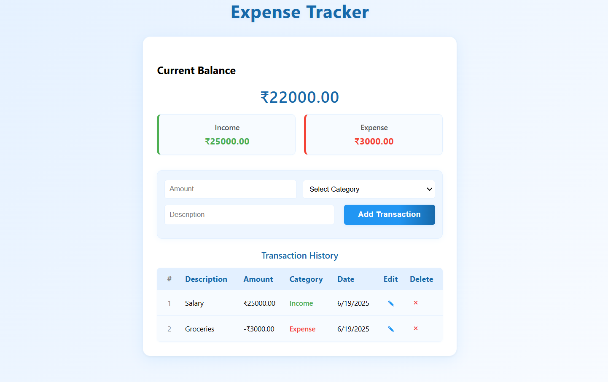

# 💸 Expense Tracker

A modern, responsive web application to track your income and expenses, manage your budget, and gain insights into your personal finances. Add, edit, and delete transactions with ease, and see your balance, income, and expenses at a glance.



[](LICENSE)
[](https://developer.mozilla.org/en-US/docs/Web/HTML)
[](https://developer.mozilla.org/en-US/docs/Web/CSS)
[](https://developer.mozilla.org/en-US/docs/Web/JavaScript)
[](https://git-scm.com/)
[](https://github.com/)
[](https://pages.github.com/)

---

## ✨ Features

- 💰 Add income and expense transactions (₹)
- 📝 Edit and delete transactions with one click
- 📊 See your current balance, total income, and total expense
- 🗂️ Transaction history with serial numbers and categories
- 🎨 Modern, professional, and responsive UI
- 🖊️ Category color coding (green for income, red for expense)
- 🖱️ Intuitive form with validation and update mode
- 📱 Fully responsive design for all devices

---

## Usage

1. Enter the amount and select the category (Income/Expense).
2. Add a description and click "Add Transaction".
3. Your balance, income, and expense update instantly.
4. Edit or delete any transaction using the pen (✎) or cross (×) icons.

---

## 🚀 Tech Stack

- **HTML5** – For structuring the web page
- **CSS3** – For styling and responsive design
- **JavaScript (ES6+)** – For interactive functionality
- **Git** – Version control
- **GitHub** – Code hosting
- **GitHub Pages** – Static website hosting

---

## 🛠️ Getting Started

1. **Clone the repository:**
   ```bash
   git clone https://github.com/your-username/expense-tracker.git
   ```
2. **Change to the project directory:**
   ```bash
   cd expense-tracker
   ```
3. **Open the app:**
   - Open `index.html` in your web browser.

---

## 🖼️ Customization & Screenshots

- Add your own screenshots or GIFs to highlight features and UI.
- Update colors and styles in `styles.css` to match your preferences.

---

## 🌐 Deployment

Deploy your Expense Tracker easily using **GitHub Pages**, **Netlify**, or **Vercel** for free.

---

## 🤝 Contributing

Contributions are welcome!  
Feel free to open issues or submit pull requests to improve the app.

---

## 📄 License

This project is licensed under the MIT License - see the [LICENSE](LICENSE) file for details.

---

## Contact

Your Name - [@pvm_harsha](https://x.com/pvm_harsha)  
Project Link: [Expense Tracker](https://github.com/pvm-harshavardhan/expense-tracker)

--- 